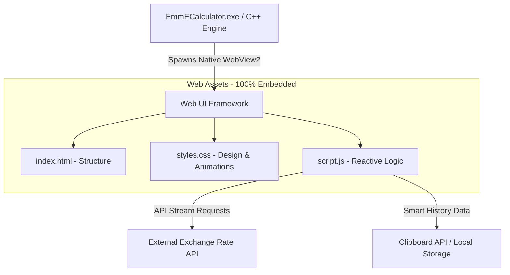

# 🌌 EmmE Calculator

[](https://github.com/)
[](https://github.com/)
[](https://github.com/)
[](https://neutralino.js.org/)

A stunning, premium-grade, and futuristic desktop calculator application designed with modern aesthetics (glassmorphism, vibrant HSL tailored colors, and sleek micro-animations) and packed with versatile functional modules. 

Unlike heavy, traditional desktop wrappers like Electron (which compile to over **60MB+**), **EmmE Calculator is engineered using Neutralinojs, resulting in a single standalone executable file of only 1.83MB!** It is incredibly fast, responsive, and easy to share with friends.

---

## ✨ Features

### 🎨 Premium Visual Aesthetics
*   **Futuristic Cyberpunk Glassmorphism Layout:** Gorgeous visual overlays, glowing holographic particles, and modern high-fidelity typography.
*   **Vibrant Interactive Elements:** Sleek pop-and-click feedback, fluid grid ripple animations on keystrokes, and a glowing pulse effect on the equals key.
*   **Theme Engine:** Instantly switch between multiple high-contrast neon accents (Neon Lime, Pink Cyber, Cyan Haze, Yellow Aura).
*   **Responsive Control Dashboard:** Clean vertical sidebar with smooth transitions for quick navigation between toolsets.

### 🧮 Multi-Disciplinary Workspaces
1.  **Standard Mode:** Classic calculations with clear history and a mini-terminal debugger screen showing internal program actions in real-time.
2.  **Scientific Mode:** Dedicated calculations for engineers, including trigonometric operations ($sin$, $cos$, $tan$), logarithms ($log$, $ln$), brackets, and powers.
3.  **Developer Mode:** Real-time multi-base calculator (Hexadecimal `HEX`, Decimal `DEC`, Octal `OCT`, Binary `BIN`) syncing keystrokes instantly across all four bases.
4.  **Exchange Rate Converter:** Livesync global currency streams (converting between USD, EUR, LKR, GBP, AUD, etc.) using live API feeds, with active rate swap and live conversion toggles.

### 🛠️ Advanced Utility Extensions
*   **Smart Data Tape:** A scrolling calculation history tape allowing you to view and copy past equations and answers instantly using a clipboard copier.
*   **Developer Quick Converter:**
    *   **Data Storage:** Dynamic Byte-to-Kilobyte/Megabyte/Gigabyte calculator.
    *   **CSS Layout Units:** Real-time Pixels (px) to REM design converter.
*   **System Settings:** Personalize UI configurations, toggle key sounds, set up custom API keys for currency APIs, and view session statistics.

---

## ⚡ Quick Start (Windows Standalone)

We have packaged the Windows application in an extremely compact, single-file ZIP archive ready for immediate deployment.

1.  Download the compiled ZIP folder: **`EmmECalculator-Windows.zip`** from the repository releases.
2.  Extract the folder `EmmECalculator-Release` to your preferred directory.
3.  Double-click **`EmmECalculator.exe`** to launch the application instantly.

> [!NOTE]
> Since this is a custom-compiled standalone C++ executable, your Windows Defender/SmartScreen may show a security prompt when opening it for the first time. Simply click **"More info"** and select **"Run anyway"** to launch.

---

## ⚙️ Architecture & Technical Stack

EmmE Calculator uses a decoupled web-native frontend connected to a lightweight C++ backend container powered by **Neutralinojs**.



### Stack Components:
*   **Frontend Logic:** Pure Vanilla JS (ES6) - No bulky frameworks, ensuring instant loading and sub-millisecond execution.
*   **Styling System:** Vanilla CSS3 - Utilizing CSS variables, flexbox/grid architectures, `@keyframes` custom cubic-bezier animations, and backdrop filters for glassmorphism.
*   **Desktop Wrapper:** **Neutralinojs v6.7.0** - Utilizing the operating system's native Web Browser engine (Edge/WebView2 on Windows, WebKitGTK on Linux, WebKit on macOS) to eliminate the huge Chromium bundle.

---

## 🛠️ Development & Building from Source

To run this application locally in development mode or compile it for alternative operating systems (macOS, Linux), follow these steps:

### Prerequisites:
*   [Node.js](https://nodejs.org/) (v16 or higher) installed on your system.

### Steps:

1.  **Clone the Repository:**
    ```bash
    git clone https://github.com/your-username/emme-calculator.git
    cd emme-calculator
    ```

2.  **Download Neutralinojs Binaries:**
    Run the following command to download the operating-system-specific engine binaries and types:
    ```bash
    npx @neutralinojs/neu update
    ```

3.  **Run in Development Mode:**
    Launch a local dev server with hot-reload and web inspector console enabled:
    ```bash
    npx @neutralinojs/neu run
    ```

4.  **Build standalone binaries for all platforms:**
    Compile highly compressed binaries with resources embedded inside them for Windows, macOS, and Linux:
    ```bash
    npx @neutralinojs/neu build --embed-resources
    ```
    Your compiled standalone executables will be generated inside the `dist/emme-calculator/` folder!

---

## 📄 License

This project is licensed under the MIT License - feel free to use, modify, and distribute it!

---

*Made with 💖 by EmmE Calculator Team.*
